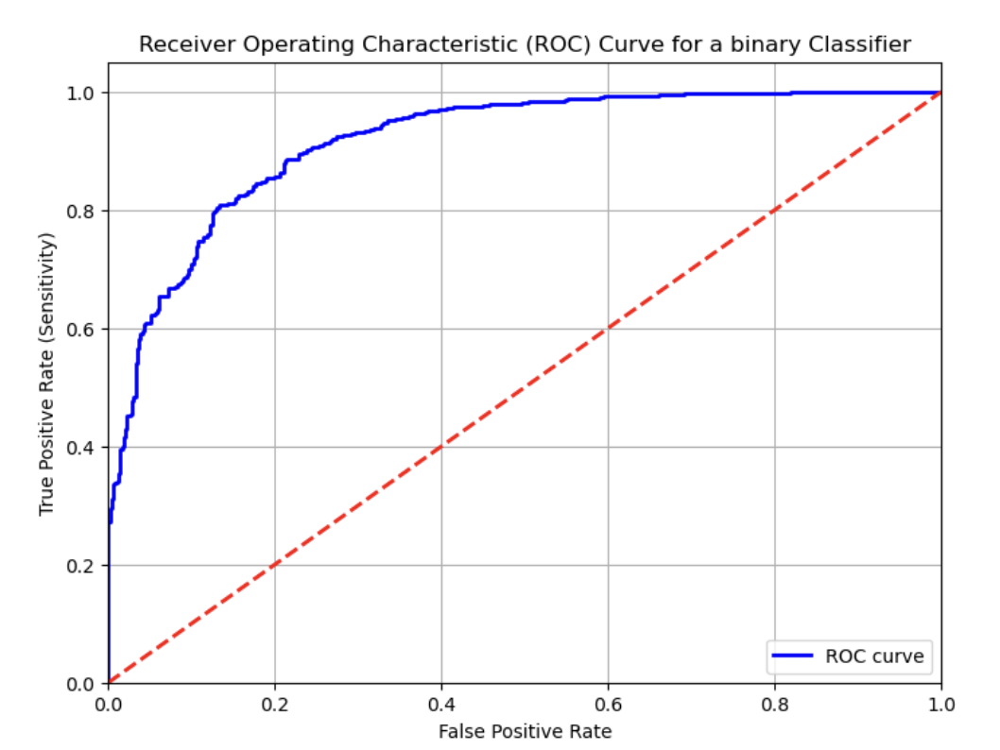
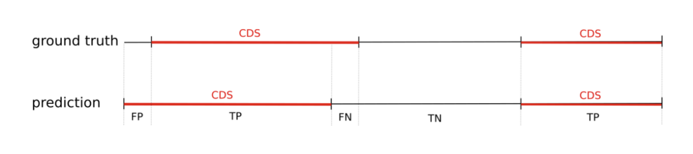

[](https://classroom.github.com/a/uJbh_DoJ)
<sub>Prof. K. Nieselt and Prof. S. Nahnsen - Institute for Bioinformatics and Medical Informatics - University of Tübingen - SoSe 2024</sub>

# Grundlagen der Bioinformatik - Assignment 10

**Hand out:** Thursday, July 4, 18:00

**Hand in:** Thursday, July 11, 18:00
>>>>>>> template/dev

> 💡Please read the task descriptions carefully. If there are any questions, you may ask them during the tutorial session or in the forum of ILIAS. You will usually get an answer in time, but late e-mails (e.g. the evening of the hand-in) might not be answered in time. You can push local changes to your fork as often as necessary, but make sure your final solution is pushed before the deadline!

## Theoretical Assignments

> 💡Please provide your answer in this document. If you want to include pictures, please include only good quality pictures or scans. Make your life easier by using a markdown preview tool such as https://dillinger.io/ for editing. Please double check correct formatting on your GitHub fork before you hand in.

### 1. Classification Measurements (4P)

In the lecture, we discussed the important metrics of sensitivity, specificity, and accuracy in the context of the gene classification algorithm GenScan. To deepen your understanding of the metrics please answer the following questions:

(a) Can you think of a bioinformatics application that needs high sensitivity, however the specificity is not as important? (Max. 100 words). **(1 P)**

### Answer

For screening infectious diseases in a population, high sensitivity is crucial. The goal is to catch as many infected individuals as possible to prevent the disease from spreading. Missing an infected person (false negative) is much worse than having a few false alarms (false positives), which can be checked later with more precise tests. Thus, high sensitivity is more important than high specificity in this context.


(b) What about the other way around, a bioinformatics application that needs high specificity but the sensitivity is not as important? (Max. 100 words). **(1 P)**

### Answer

It is essential to have high specificity when screening donors for organ donation. This helps to guarantee the safety and infection-free status of the organs being transplanted, reducing the risk of health complications for recipients. While there is a possibility of missing out on some potential donors (low sensitivity), it is more crucial to have confidence in the health of the selected donors.

**ROC Curves**

_Receiver Operating Characteristic_ (ROC) curves are plots that show the performance of a classifier for varying classification thresholds. In this sense, think of a classifier as a type of model that outputs a number for a given input and then categorizes that input into one of two classes based on a classification threshold. So, the threshold value determines the point for which a classifier transitions to predict one class or the other (e.g. negative and positive) and if you lower the classification threshold, more items will be classified as positive, increasing false positives and potentially true positives. For example, think of a classifier that predicts coding and non-coding genes with a set threshold of 0.8. Every sequence with a _value_ below $0.8$ will be classified as non-coding and sequences above $0.8$ will be classified as coding. Now, a ROC curve plots the

_True Positive Rate_ (sensitivity):

$TPR = {TP \over TP + FN}$

against the _False Positive Rate_ (FPR):

$FPR = {FP \over FP + TN}$

for various thresholds.

(c) Consider the following ROC curve of a gene classification software: **(2 P)**

- How do you interpret the progression of the curve in terms of the predictive power of the software?
- Discuss the trade-off between sensitivity  and specificity as you move along the curve from he bottom left to the top right.
- Explain what the red line represents.
- Discuss what it means if the roc curve is close to the top-left corner compared to being close to the diagonal line

(Max. 200 words)

<p align= "center">
  
</p>

### Answer

The ROC curve of the gene classification software illustrates its ability to distinguish between positive and negative gene classifications based on different decision thresholds. As the curve progresses from the bottom-left to the top-right, it shows the trade-off between sensitivity (true positive rate) and specificity (true negative rate). Starting at the bottom-left, the curve rises steeply, indicating high sensitivity where the software correctly identifies most positive cases but with increased false positives, hence lower specificity. Moving towards the top-right, the curve reaches a point where sensitivity and specificity are balanced optimally. Here, the software accurately identifies true positives while minimizing false positives.

The red diagonal line from bottom-left to top-right represents the performance of a random classifier. A ROC curve close to this line suggests the software performs no better than random guessing. Conversely, a curve near the top-left corner signifies strong predictive power, achieving high sensitivity and specificity simultaneously. This indicates the software accurately distinguishes between positive and negative classifications.

Therefore, interpreting the ROC curve helps evaluate how well the software predicts gene classifications and determines the threshold that balances sensitivity and specificity effectively. A curve near the top-left corner indicates robust performance, while proximity to the diagonal line suggests poorer predictive capability.

## Practical Assignments

> 💡For the practical assignments you should keep a good structure in your code, e.g. implement separate functions to solve the sub-tasks presented. All code must be well documented. Points will be deducted for insufficient comments. If we can’t run your program, it will not be graded. _All code and reference files are found within the repository, please implement your solution and push. Ensure that your final solution is merged into the main branch of your repository._

### 2. PSWM of binding sites of a transcription factor (4P)

For this task you only need to use a tool to compute a multiple sequence alignment. The other sub-tasks should be computed by hand.

Assume a transcription factor TF has been measured to bind a set of 10 sequences:

`AGTAGCCA, CGTTCCTACA, GTTGGTACC, GTTGCCA, TGTCGCCATG, CGTTGTCAT, AGTTACCA, GTTAGCACA, GTTTTTATG, GGTTGGTA`

(a) Compute a multiple sequence alignment of these 10 sequences. We propose to use the [Clustal server at UniProt](https://www.uniprot.org/align) (that you already have used in Assignment No 4), but you may also use another tool. If you choose to use another tool, please cite the tool you used for the MSA. **(1 P)**

(b) Identify the core residue part of the alignment that can be aligned without gaps. **(0.5 P)**

(c) Convert the ungapped multiple alignment from (b) into a position specific weight matrix (PSWM), as introduced in the lecture using the maximum-likelihood method (i.e., normalized counts for each column of the matrix). **(1 P)**

(d) From this compute the PSWM with logarithmic propensity values using $q(A) = q(T) = q(G) = q(C) = \frac{1}{4}$ as background values (Careful: Here you need to use Laplace pseudocounts). **(1.5 P)**

`Hand in the MSA, the core MSA, the PSWM of (c) and the PSWM with logarithmic propensities of (d).`

### Answer

````
Input for UniPort:

>
AGTAGCCA
>
CGTTCCTACA
>
GTTGGTACC
>
GTTGCCA
>
TGTCGCCATG
>
CGTTGTCAT
>
AGTTACCA
>
GTTAGCACA
>
GTTTTTATG
>
GGTTGGTA
````


### 3. Gene prediction performance comparison (12P)

In this task we ask you to compare two gene prediction methods of your choice from the following set: PROKKA, GeneMark, and Bakta, three gene prediction software tools that use either a dynamic programming approach (Prokka), hidden Markov models (GeneMark) or linear combination (Bakta) to identify coding regions in prokaryotic DNA.

We have already run all three gene prediction methods on the genome of _Treponema pallidum_ with a total length of `1139633` bp. Your task is to compare their respective output to a reference file, which we consider as the ground truth. All three programs output their feature predictions in a `.gff` file format. This format is used to describe predicted features like CDS (short for coding sequence, so the ORF) or exon of DNA sequences. However, we have converted the output into a simpler table format, only including CDS, and provide you with the class `TSVReader.java` for parsing. Still, make yourself familiar with the respective file format before working on this task. The respective files are stored in this repository as follows:

```
    - data/reference_cds.tsv    The ground truth CDS.
    - data/bakta_cds.tsv        The CDS predicted with Bakta.
    - data/prokka_cds.tsv       The CDS predicted with PROKKA.
    - data/genemark_cds.tsv     The CDS predicted with GeneMark.
```

In more detail, we only want to examine the CDS on the nucleotide resolution level. Therefore, we count nucleotides/positions that are predicted correctly (true positives (TP), true negatives(TN)) and not correctly (false positives (FP), false negatives(FN)) as either being ‘coding’ or ‘not coding’, which is indicated in the following scheme:

<p align= "center">
    
</p>

Note: The sum of TP, TN, FP, and FN equals the length of the genome. Make sure that when calculating the sum of TP, TN, FP, and FN you consider that the predictions are made for both strands of the genome.

(a) Write a Java program that compares predicted CDS with a ground truth. Compute TP, TN, FP, and FN as described in the introduction by comparing the CDS regions of the respective files and providing them with your program output. Additionally, compute the sensitivity, specificity, and accuracy of the respective prediction tool. You may want to utilize the `CDSPredictionComparator.java` as template code. **(9 P)**

Your program is expected to be executable as:

`java CDSPredictionComparator <ground_truth_cds_file>.tsv <predicted_cds_file>.tsv <genome_positions>`

The output of your program is expected to look as follows:

```
Predicted CDS: <path/to/predicted_cds.file>
True CDS: <path/to/truth_cds.file>
TP: <integer>
TN: <integer>
FP: <integer>
FN: <integer>
Sns.: <float>
Spc.: <float>
Acc.: <float>
```

(b) Run your program to compare two of the three predictions, report the output in the answer section below and cite the tools that you compared in this task. Which of the two prediction tools would you use based on the calculated statistics? Justify your answer. (Max. 100 words). **(3 P)**

### Answer

### Example Usage

````
javac CDSPredictionComparator
javac TSVReader
java CDSPredictionComparator D:\\GIT\\assignment-10-maier-novikova\\data\\reference_cds.tsv D:\\GIT\\assignment-10-maier-novikova\\data\\prokka_cds.tsv 1139633
java CDSPredictionComparator D:\\GIT\\assignment-10-maier-novikova\\data\\reference_cds.tsv D:\\GIT\\assignment-10-maier-novikova\\data\\genmark_cds.tsv 1139633
````

````
GBI - Assignment 10 Task 03 - Polina Novikova, Marius Maier
Predicted CDS: D:\GIT\assignment-10-maier-novikova\data\genmark_cds.tsv
True CDS: D:\GIT\assignment-10-maier-novikova\data\reference_cds.tsv
TP: 1025277
TN: 63139
FP: 36523
FN: 14694
Sns.: 0,985871
Spc.: 0,633531
Acc.: 0,955058


GBI - Assignment 10 Task 03 - Polina Novikova, Marius Maier
Predicted CDS: D:\GIT\assignment-10-maier-novikova\data\prokka_cds.tsv
True CDS: D:\GIT\assignment-10-maier-novikova\data\reference_cds.tsv
TP: 1017142
TN: 71117
FP: 28545
FN: 22829
Sns.: 0,978048
Spc.: 0,713582
Acc.: 0,954921


Both Prokka and GenMark show high accuracy (0.954921 and 0.955058), 
with GenMark slightly outperforming Prokka.

GenMark also has a higher sensitivity (0.985871) compared to Prokka (0.978048), 
indicating it is better at identifying true positives. 

However Prokka has a better specificity (0.713582) than GenMark (0.633531), 
witch might mean it is better at identifying true negatives.

Considering the task might prioritize identifying true positives (higher sensitivity) over minimizing false positives (specificity), 
GenMark would be the preferred tool based on the calculated statistics.
````

