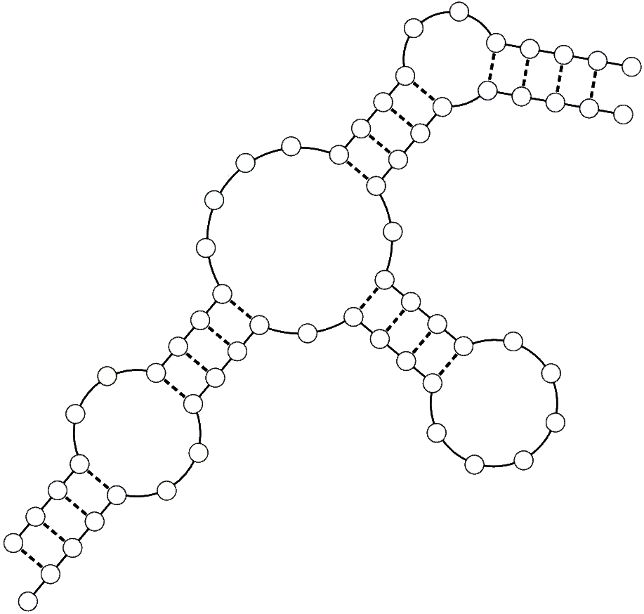

[](https://classroom.github.com/a/vWk61TQ8)
<sub>Prof. K. Nieselt and Prof. S. Nahnsen - Institute for Bioinformatics and Medical Informatics - University of Tübingen - SoSe 2024</sub>

# Grundlagen der Bioinformatik - Assignment 11

**Hand out:** Thursday, July 11, 18:00

**Hand in:** Thursday, July 18, 18:00

> 💡Please read the task descriptions carefully. If there are any questions, you may ask them during the tutorial session or in the forum of ILIAS. You will usually get an answer in time, but late e-mails (e.g. the evening of the hand-in) might not be answered in time. You can push local changes to your fork as often as necessary, but make sure your final solution is pushed before the deadline!

## Theoretical Assignments

> 💡Please provide your answer in this document. If you want to include pictures, please include only good quality pictures or scans. Make your life easier by using a markdown preview tool such as https://dillinger.io/ for editing. Please double check correct formatting on your GitHub fork before you hand in.

### 1. Identification of RNA Secondary Structure Elements (1P)

In the lecture you have learned about RNA secondary structure elements. Consider the following schematic of a RNA secondary structure; Highlight and name four different secondary structure elements in the image.

<p align= "center">
  
</p>

### Answer


### 2. Visualization of RNA Secondary Structures (2P)

For the following two RNA sequences, their respective secondary structure representation is provided in (extended) dot-bracket format. You are asked to draw their secondary structure as a `graph` (cf. the image from task one) and in the `arc representation`.

**(a) Hairpin Structure**

```
CACGCUGAACGUACU
.(((.....)))...
```

### Answer


**(b) Pseudoknot Structure**

```
ACCCGUAAACGGGCCUUA
..((..[[...))..]].
```

### Answer


### 3. Nussinov Algorithm - By Hand (8.5P)

**(a)** The pseudo code for the traceback of the Nussinov algorithm - as presented in the lecture - does not return the actual RNA secondary structure, e.g. in the form of the dot bracket notation. You are asked to modify the Nussinov folding algorithm so that the traceback reconstructs a valid dot-bracket notation for secondary structures. Hand in the extended pseudo code of the traceback.

### Answer


(b) For the sequence `AGAGUCCACUGA` compute the secondary structure using the original Nussinov algorithm. Please hand-in the DP matrix, highlight the traceback which contains a bifurcation and provide that solution in its dot-bracket notation.

### Answer


### 4. Quality of protein secondary structure prediction (6P)
Imagine you were asked to test the quality of an algorithm predicting the secondary structure of proteins.
$H$= helix, $E$= beta strands, $C$= coils or loops.


You assembled the overall misclassification errors of $H$, $E$ and $C$ states where H $\leftrightarrow$ E shows the misclassification between helix and beta strand, H $\leftrightarrow$ C shows the misclassification between helix and coil, and E $\leftrightarrow$ C shows the misclassification between beta strand and coil. You also determined the misclassification errors of the boundary regions of the respective secondary structure elements (H/E/C (boundary)).
The $Q_3$ (internal) and $Q_3$ (boundary) shows the prediction accuracy for internal and boundary regions of secondary structure elements. Your findings are summarized in the following table: 

|     | Method (%) |
|-----|---------|
H $\leftrightarrow$ E  |	0.96 |
H $\leftrightarrow$ C	| 9.5	|
E $\leftrightarrow$ C  | 7.6 |
H/E/C (boundary)|	37.9/38.3/24.3  |
$Q_3$ (internal)|	87.9  |
$Q_3$ (boundary)| 68.6  |

**(a)** Can you find an explanation why the misclassification error between H $\leftrightarrow$ E  is lower than for H $\leftrightarrow$ C and E $\leftrightarrow$ C? (Max. 50 words)

### Answer

````
maybe because helices (H) and beta strands (E) might have more distinct and regular hydrogen
bonding patterns and (backbone) dihedral angles compared to coils (C) (which are more irregular and variable).
````

**(b)** Looking at the classification errors of the boundary regions for secondary structure elements. Discuss briefly possible reasons for the varying errors. (Max. 50 words)

### Answer

````
classification errors in the boundary regions might be higher because these regions are,
 where one structure changes into another, making them less clear and more likely to be confused with each other.
(secondary structure elements are less well-defined and exhibit features of both adjacent structures
->increased ambiguity and misclassification)
````

**(c)** Can you think of an explanation for the higher accuracy of predictions for the internal regions compared to boundary regions? (Max. 50 words)

### Answer

````
internal regions have more consistent and clear patterns, making them easier to predict correctly.
Boundary regions, being in transition between different structures, are less clear and harder to predict accurately.
````


### 5. Torsion angles and Ramachandran (2.5P)

In this task you are asked to answer multiple-choice questions on the subject of torsion angles and Ramachandran plots. For some questions more than one answer may be correct. It is sufficient to enter the number of the answer you wish to submit in the corresponding fields.

**(a)** How many bonded atoms are required to constitute a dihedral (torsion) angle, such as $\phi$ or $\psi$?

1. None
2. `1`
3. `2`
4. `3`
5. `4`
6. `5`
   
### Answer

5.

**(b)** The number of $\phi$ and $\psi$ angles in an isolated amino acid (not in a polypeptide chain) is:

1. None
2. `1`
3. `2`
4. `3`
5. `4`
6. `5`

### Answer

1.

**(c)** $\phi$ and $\psi$ angles directly determine 

1. Primary structure
2. Secondary structure
3. Tertiary structure
4. Quaternary structure.

### Answer

2.

**(d)** $\alpha$ helices are compatible with 

1. All possible $\phi$- $\psi$ angle combinations.
2. A limited range of $\phi$- $\psi$ angle combinations.
3. A limited range of $\phi$ angles with all possible $\psi$ angles.
4. A limited range of $\psi$ angles with all possible $\phi$ angles.

### Answer

2.

**(e)** In a Ramachandran plot, the dots cluster 

1. Where clashes occur.
2. Where clashes do not occur.
3. Where $\alpha$ helices occur.
4. Where $\beta$ strands occur.
5. Where $\alpha$ helices, $\beta$ strands, and turns do not occur.
6. Where the $\phi$ and $\psi$ angles are energetically favorable.

### Answer

2, 3, 4, 6.
