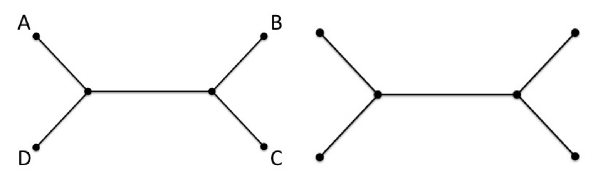

<sub>Prof. K. Nieselt and Prof. S. Nahnsen - Institute for Bioinformatics and Medical Informatics - University of Tübingen - SoSe 2024</sub>

# Grundlagen der Bioinformatik - Assignment 04

**Hand out:** Thursday, May, 16, 6pm

**Hand in:** Thursday, May, 30, 6pm

> 💡Please read the task descriptions carefully. If there are any questions, you may ask them during the tutorial session or in the forum of ILIAS. You will usually get an answer in time, but late e-mails (e.g. the evening of the hand-in) might not be answered in time. You can push local changes to your fork as often as necessary, but make sure your final solution is pushed before the deadline!

## Theoretical Assignments

> 💡Please provide your answer in this document. If you want to include pictures, please include only good-quality pictures or scans. Make your life easier by using a markdown preview tool such as https://dillinger.io/ for editing. Please double-check check correct formatting on your GitHub fork before you hand it in.

### 1. Unlabeled branching pattern (1P)

For unrooted binary trees, how many leaves do there have to be at least to obtain more than one unlabeled branching pattern? Provide sketches of the topologies to support your answer. An example of a labeled and respective unlabeled tree for $n = 4$ sequences is shown in the following figure.



### Answer


### 2. Quaternary Trees (3P)

Consider unrooted quaternary trees which have five edges radiating from every branch node. If there are $n$ leaf nodes in an unrooted quaternary tree, how many internal nodes and how many edges are in these trees? Come up with an equation for both problems that depend on $n$ (similar to equations in Lemma 6.3.5 in the lecture notes). Either explain how you deduced your equation or prove your equations.

### Answer

```
I = number internal nodes
L = number leaf nodes (n)
E = number edges

In general the number of radiating edges (degree) from all of the nodes is twice the number of edges:
S = 2E

each internal node adds 5 and each leaf node adds 1 to the degree sum
-> S = 5I + n -> E = 5I + n

a tree with N nodes always has N - 1 edges
-> N = I + n because each node is either an internal or a leaf node
-> E = (I + n) - 1

Combination:

5I + n = 2((I + n) - 1)
5I + n=2I + 2n − 2
3I = n - 2
 I = (n - 2) / 3

put I into E = (I + n) - 1:
(((n - 2) / 3) + n ) - 1
( (n - 2 + 3n) / 3) - 1
( (4n - 2) / 3) - 1
( (4n - 2 - 3) / 3)
( (4n - 5) / 3)

Equation for internal nodes I = (n - 2) / 3
Equation for number of edges E = ((4n - 5) / 3)


```
Examples:


### 3. Marker genes for the prokaryotic Tree of Life (4P)

In the lecture, two universal marker genes (16S rRNA and aminoacyl-tRNA synthetase) were discussed as they are used in phylogenetic reconstructions of prokaryotes. Try to find general criteria for marker genes (in terms of phylogenetic reconstruction) in prokaryotes. Write a maximum of 100 words and provide literature references in your answer.

### Answer

by choosing markers that are less **conserved** in their sequences within a lineag of interest, 
it is possible to better predict genome-wide gene sequence similarity between closely related prokaryotes. 
Another one is adequate variability to provide phylogenetic resolution and a slow rate of horizontal gene transfer to reflect true evolutionary history


(https://microbiomejournal.biomedcentral.com/articles/10.1186/s40168-016-0162-5
Lan, Y., Rosen, G. & Hershberg, R. Marker genes that are less conserved in their 
sequences are useful for predicting genome-wide similarity levels between closely related prokaryotic strains. 
Microbiome 4, 18 (2016).


Yarza, P., et al. (2014). Uniting the classification of cultured and uncultured bacteria and archaea using 16S rRNA gene sequences. Nature Reviews Microbiology, 12(9), 635-645.


### 4. UPGMA Tree from an MSA (4P)

For the following ungapped multiple sequence alignment of cytochrome C from the four species _Rickettsia philipii_, _Rickettsia prowazekii_, _Bradyrhizobium sp._, _Agrobacterium sp._ compute (by hand) the UPGMA tree, showing each step.

```
NIPELMKTANADNGREIAKK
NIQELMKTANANHGREIAKK
PIEKLLQTASVEKGAAAAKK
PIAKLLASADAAKGEAVFKK
```

For this, first compute the distance matrix using as distance function $d(i,j) = -\ln(1 - d_H(i,j))$, where $d_H$ is the (normalized) Hamming distance as defined in the lecture.
Is the computed phylogenetic tree consistent with respect to the input distance matrix?

### Answer


Is the computed phylogenetic tree consistent with respect to the input distance matrix?

Ja im Baum sind A und B am nähesten beieinander was sich auch in der jeweiligen Eintrag der Distanzmatrix wiederspiegelt. (Analog mit C und D)


Aber z.B.: A und D sind im Baum weiter auseinander als B und D, was sich so in der Distanzmatrix nicht rauslesen lässt da die Distanzen (A,D) = (B,D) sind. (Analog mit A/B und C)


## Practical Assignments

### 5. Analysis of ancient DNA sequences using BLAST, ClustalOmega, NJ and Maximum Parsimony (8P)

In 1979, a well-preserved specimen of the Siberian woolly mammoth (Mammuthus primigenius) was recovered from the Siberian permafrost. Its gene for mitochondrial cytochrome b could be sequenced, we provided you with the respective translated DNA sequence in `data/CYB MAMPR.fasta`. Using BLAST and a multiple sequence alignment we want to answer the question of how much the cytochrome b sequence changed since the extinction of this species and how similar it is to that of other extant species.

**a)** Use the [BLAST webserver of UniProt](https://www.uniprot.org/blast/) to compare the protein sequence (as translated from the ancient DNA sequences) to the modern protein database. BLAST with the Mammuthus sequence, choose in the ‘Restrict by taxonomy’ Afrotheria and 0.0001 as E-Threshold.

### Answer
Instructions above were followed.
Blasting resulted in 9 Hits:

````
+------------+-----------------+------------------------------------------------+--+--+--+--+--+--+--+
| Entry/ID   | Similarity in % | Name                                           |  |  |  |  |  |  |  |
+------------+-----------------+------------------------------------------------+--+--+--+--+--+--+--+
| P92658     | 100             | Mammuthus primigenius (Siberian wolly mammoth) |  |  |  |  |  |  |  |
| P24958     | 97.9            | Loxodonta africana (African elephant)          |  |  |  |  |  |  |  |
| O47885     | 96.3            | Elephas maximus (indian (asian) elephant)      |  |  |  |  |  |  |  |
| A0A2Y9TL84 | 82.3            | Florida manatee                                |  |  |  |  |  |  |  |
| Q33401     | 82.3            | Dugong dugong (Trichechus dugon)               |  |  |  |  |  |  |  |
| Q7Y8J5     | 79.4            | Rock hyrax                                     |  |  |  |  |  |  |  |
| Q8LWU4     | 79.9            | Short-eared elephant shrew                     |  |  |  |  |  |  |  |
| Q9THD6     | 80.2            | Aardvark                                       |  |  |  |  |  |  |  |
| Q7Y8I2     | 78              | Cape golden mole                               |  |  |  |  |  |  |  |
+------------+-----------------+------------------------------------------------+--+--+--+--+--+--+--+

````
Picture:


**b)** Select all hits based on the BLAST results and conduct a multiple sequence alignment using ClustalOmega that is also offered by UniProt. On the Results Summary page, study the Percent Identity Matrix to determine the pairwise similarity of the sequences. Which organisms are most closely related to the ancient mammoth?
### Answer
Selecting all hits and aligning resulted in an error, so i used the Id's as input


Percentage Identity Matrix:


- The Matrix is symmatric, so its sufficient to just analyze the upper or lower triangular part of this matrix.


- First of all the diagonal shows the proetin sequences compared with itself so of course it results 
into 100% identity along the diagonal.


**The most notiable similaritys seem to be among the first 3 entries of the matrix:**


P92658 (1) and P24958 (2) have a high identity score of 97.88%.


aswell as 


P92658 (1) and O47885 (3) with 96.30%.


P24958 (2) and O47885 (3) also share a score of 97.88%


the next most similiar score is much further down on the diagonal line with A0A2Y9TL84 and Q33401 with a score of 95.51%


- After that the score drops below 90% on other similarity checks between protein sequences.
The pattern shows the closer a cell is to the diagonal the higher the corresponding score is. 

Most colosely related organisms to the Mammuthus primigenius (Siberian woolly mammoth), are the 
- Loxodonta africana (African elephant)
- Elephas maximus (Indian elephant)

both with similaritys over 95%.


**c)** Compare the pairwise BLAST alignments and the MSA based on ClustalOmega to assess how well these match.

### Answer


Both in the Matrix based on the MSA aswell as in the pariwise BLAST alignments the reuslt do infact correspond, 
with the above two mentioned organisms having the highest similarity to our mammoth. 

Also the other, much lower hits match along with the achieved MSA/Matrix scores.

**d)** Next we ask you to reconstruct the Maximum Parsimony tree from the MSA. For this task, please use the phylogenetic software package MEGA11 
http://www.megasoftware.net/ (note that this software package needs a registration, but it is free for academic users). Load the MSA as input and choose Maximum Parsimony in the Phylogeny tab. Visually compare the MP Tree with the tree computed by UniProt (using NeighborJoining based on the MSA).

### Answer


Tree1 MEGA11


Tree2 MEGA11


Tree Uniport


Trees compared


- We can observe that some clusters that formed are represented in both trees, for example the organisms highlited in
green and purple are closley connected/joined in both trees.

But in general the neighborJoining based tree is vastly diffrent from the maximum parsimony one.

- Clusters can differ from one tree to antoher: for example the orange connection, which have different "partners"
in each tree.


- The Branches are connected in diffrent ways, take for example Q8LWU4 highlighted with a red arrow. 
While in the upper tree, this organism connects relativly "early" to the purple cluster (if read from rightside), 
in the tree below the connection only happenes after green and purple cluster connected.


- Another obivous diffrence is that some "entries" are in a completly different "general" branch, like in the 
case of Q7Y8J5, which in the parsimony tree can be found in the upper main cluster, while the neighborjoining one 
has it in the lower main cluster (gray).

**e)** Compare your results (in particular the two trees) with the [Paper by Noro et al. 1998](https://pubmed.ncbi.nlm.nih.gov/9493356/): Can you confirm the findings of the paper?

### Answer

**Findings of tree analysis**

(referencing "Trees compared" above)


- The closer 2 names/ organisms are in a tree, the more they are similar to each other. 

- The upper tree for example depicts the african elephant (2) beeing more similar to the mammuth than the indian elephant is.
- Ranking each entry from top to bottom we can see diffrent results in the tree below compared to the upper one.
- The neighbor joining tree for example says, that the short eared elephant shrew (7) is closer related to our mammoth (1) 
then the Florida manatee (4) is. 

While the upper tree computed by maximum parsimony says is the other way around.

So from Index 4 to 7, the trees differ vastly and with that also their context on how closeley these organisms are related.

**Findings of Paper**

The study aimed to clarify the phylogenetic relationships among these oragnisms.
- The phylogenetic trees supported a closer relation between the woolly mammoth and the african elephant (Loxodonta) 
rather than the asian elephant (Elephas), which is also present in our finding.
- But this result stands in contrast with some earlier morphological studies suggesting that 
the mammoth is more closely related to asian than to the african.
- Also a "larger sample size (both the
  number of specimens and genes, and the sequence length
  examined) is necessary to further understand the precise
  phylogenetic relationships in Elephantinae"
- The results highlight the importance of using such "techniques" to resolve phylogenetic relations
that are difficult to determine just on morphological data alone.
