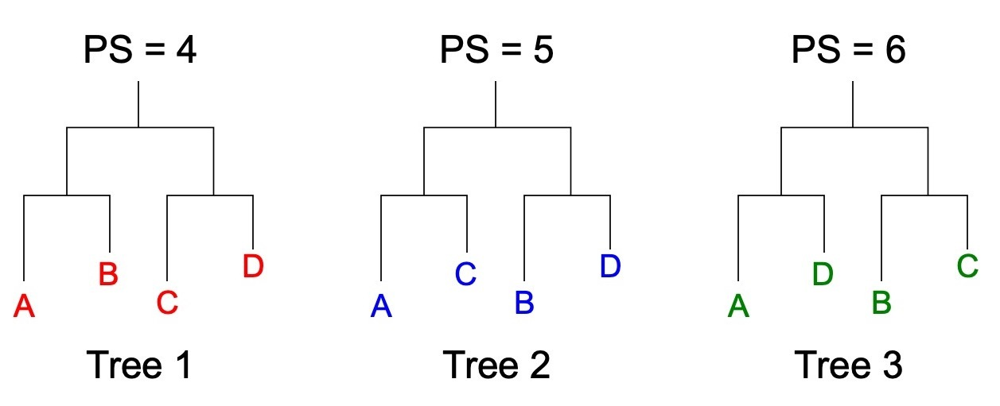

[](https://classroom.github.com/a/YK2VzJQX)
<sub>Prof. K. Nieselt and Prof. S. Nahnsen - Institute for Bioinformatics and Medical Informatics - University of Tübingen - SoSe 2024</sub>

# Grundlagen der Bioinformatik - Assignment 05

**Hand out:** Thursday, May, 30, 6pm

**Hand in:** Thursday, June, 6, 6pm

> 💡Please read the task descriptions carefully. If there are any questions, you may ask them during the tutorial session or in the forum of ILIAS. You will usually get an answer in time, but late e-mails (e.g. the evening of the hand-in) might not be answered in time. You can push local changes to your fork as often as necessary, but make sure your final solution is pushed before the deadline!

## Theoretical Assignments

> 💡Please provide your answer in this document. If you want to include pictures, please include only good quality pictures or scans. Make your life easier by using a markdown preview tool such as https://dillinger.io/ for editing. Please double check correct formatting on your GitHub fork before you hand in.

### 1. Algorithm: UPGMA (2P)

Consider the following description of the UPGMA algorithm:

> **Input:** A set of taxa $X = {x_1,...,x_n}$ and a corresponding distance matrix _D_
>
> **Output:** A binary, rooted phylogenetic UPGMA tree $T=(V,E,ω)$ on _X_
>
> **Initialization:**
>
> - _Set_ _C={C_1={x_1},...,C_n={x_n}}_
> - _Set_ _h({x_i}) = 0_
> - _Set_ $V = C$ _and_ $E = ∅$
> - _Set_ $k = n$
>
> **Iteration:**
>
> While $|C| > 2$ do:
>
> - Determine two clusters $C_i$ and $C_j$ for which $d(i,j)$ is minimum
> - _Set_ $k= k+1$
> - Define a new cluster _k_ by $C_k=C_i ∪ C_j$
> - _Set_ $C=(C - {C_i,C_j}) ∪ {C_k}$
> - _Set_ $d(k,l)$ for all clusters _l_ using the update formula
> - Define node _k_ with children _i_ and _j_, and place it at height $h=\frac{d(i,j)}{2}$
> - _Set_ $V = V ∪ {k}$ _and_ $E = E ∪ {(i,k),(j,k)}$
> - _Set_ $ω(i,k)=h(k)-h(i)$ _and_ $ω(j,k)=h(k)-h(j)$
>
> **Termination:**
>
> - When only two clusters $C_i$ and $C_j$ remain, place the root at height $\frac{d(i,j)}{2}$.

Describe in general terms, i.e. depending on the parameters of the algorithm, how large _k_ is when the algorithm is terminated.

### Answer


- First of all in the Initialization k ist set to n.
- While the loop is running k only can get increased, thus k never gets smaller than n ( length of set of taxa).
- We will always need two clusters for the algorithm to work/ terminate (even if it will never enter the loop), so k is atleast n.


For n > 2, k = 2n - 1:


- For each subtree we can say that 2 Clusters get merged so k was atleast 2, and for each merge the number of clusters deacreases by 1.
- To reach 2 clusters for the algo. to terminate we need n - 1 reductions.
- k is incremented by 1 in each iteration, k will be incremented n - 1 times from its initial value n.
so when the algo terminates k = n + (n - 1) = 2n - 1
- (The new k labels the newly formed cluster ( C_k ) in each step/ the single one at the end)


### 2. Maximum Parsimony (6P)

For the following three phylogenetic trees on 4 taxa $A,B,C,D$ with respective parsimony scores, set up one minimal multiple nucleotide sequence alignment (minimal with respect to the number of columns) $\textbf{A}^\*$ such that this gives rise to the respective parsimony scores $PS(T,\textbf{A}^\*)$ for the three following trees:


<p align="center">

</p>

### Answer

- 3 different trees for 4 taxa ( A, B, C, D)
- PS = how many changes in nucleotide occure in the tree.

- We need to add columns one by one to match the required PS for each tree


Start with first column:
A = G, B = G, C = T, D = T


Add second column:
A = G, B = T, C = G, D = T


For the third column we would need something like we did for the first column so our PS add up at the end :
Add third column:
A = A, B = A, C = C, D = C


This result in the Seq.:


````
A = GGA
B = GTA
C = TGC
D = TTC
````


- Every Parsimony score added up:

- 


### 3. Step-Wise Addition Heuristic to Compute a Maximum Parsimony Tree (3P)

Apply the step-wise addition heuristic as introduced in the lecture / script (p. 105-106) to the following MSA on 5 taxa to compute a (sub)optimal maximum parsimony tree for the MSA:
| | | | |
|------------|---|---|---|
| $A_{1}^*$ | T | C | C |
| $A_{2}^*$ | G | T | C |
| $A_{3}^*$ | T | T | C |
| $A_{4}^*$ | C | G | C |
| $A_{5}^*$ | C | A | C |

Start with the first three sequences, then include $A_{4}^*$ and finally $A_{5}^\*$. Provide all intermediate steps. Also report the final tree and its parsimony score.

### Answer


## Practical Assignments

> 💡For the practical assignments you should keep a good structure in your code, e.g. implement separate functions to solve the sub-tasks presented. All code must be well documented. Points will be deducted for insufficient comments. If we can’t run your program, it will not be graded. _All code and reference files are found within the repository, please implement your solution and push. Ensure that your final solution is merged into the main branch of your repository._

### 4. Validation of ultrametric and additive properties in distance matrices (9P)

In this task you are asked to implement a program `MatrixValidator.java` that checks for a given matrix if it`s a valid distance matrix and satisfies the properties of ultrametricity and/or additivity.

Please make you familiar with the following definitions of ultrametricity and additivity:

> **Three-point condition (3PC)**
>
> A distance matrix $D$ on a set of taxa $X$ is said to fulfill
> the _three-point condition_ if for all $i,j,k \in X$ > $$d(i,j)\le\max(d(i,k),d(j,k))$$
> holds.`

> **Ultrametrics and the 3PC**
>
> A distance matrix $D$ on $X$ is an ultrametric, if and only if it fulfills the
> three-point condition.

> **Four-point condition (4PC)**
>
> A distance matrix $D$ on a set of taxa $X$ is said to fulfill the {\em four-point condition} > if for all $i,j,k,l\in X$ > $$d(i,j)+d(k,l)\le\max(d(i,k)+d(j,l),d(i,l)+d(j,k))$$
> holds.

> **Tree metric and the 4PC**
>
> A distance matrix $D$ on $X$ is a tree metric, if and only if it fulfills the
> four-point condition.

Continue by following the subtasks below:

1. Implement methods to read a distance matrix from a text file (you can infer the expected format from the files in the `data` folder), validate their correctness, i.e., check if the matrix is symmetric and the diagonal elements are zero and prints out the findings.

2. Implement a method that computes for a valid input distance matrix, whether it is ultrametric.

3. Implement a method that computes for a valid input distance matrix, whether it is an additive distance / a tree metric.

4. Evaluate the three provided matrices in the `data` folder whether they are ultrametric, additive, both, or neither and report your findings.

5. Based on your findings suggest an appropriate tree reconstruction method for each matrix.

``````
Results of running the code on the provided matrices:


input file: matrix_1.txt
is valid distance matrix: true
is ultrametric: true
is tree metric: true

UPGMA
(This method is suitable for ultrametric distance matrices because
it builds a rooted tree where the distance from the root to any leaf is the same. 
Since the matrix is ultrametric, UPGMA will produce a correct tree)


input file: matrix_2.txt
is valid distance matrix: true
is ultrametric: false
is tree metric: true

Neighbor-Joining 
(ideal for additive distance matrices. 
Since Matrix 2 has the four-point condition, it can be represented by a tree metric, 
and neighbor-Joining is effective for constructing phylogenetic trees from such a matrix)


input file: matrix_3.txt
is valid distance matrix: true
is ultrametric: false
is tree metric: false

Maximum Likelihood
(capable of handling distance matrices that are neither ultrametric nor tree metrics)
``````


#### Bonus Task (2BP)

6. As a bonus task also report the number of triplets or quartets that fulfil / do not fulfil the 3PC or 4PC when evaluating the matrices in subtask 2./3.

Your program is expected to be executable as

`java MatrixValidator <path/to/file.txt>`

and return output like

```
input file: <path/to/file.txt>
is valid distance matrix: <boolean>
is ultrametric: <boolean>
is tree metric: <boolean>
```

or

```
input file: <path/to/file.txt>
is valid distance matrix: <boolean>
is ultrametric: <boolean>
- no. valid/invalid triplets: <integer>/<integer>
is tree metric: <boolean>
- no. valid/invalid quartets: <integer>/<integer>
```

dependent on whether you have solved the bonus task.
