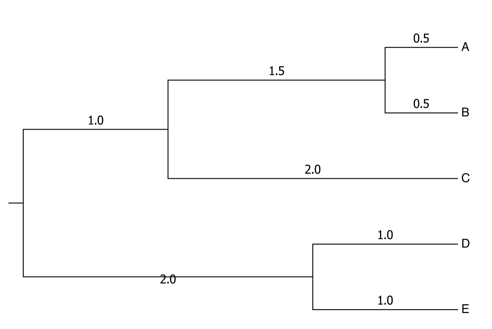

Prof. K. Nieselt and Prof. S. Nahnsen - Institute for Bioinformatics and Medical Informatics - University of Tübingen - SoSe 2024

# Grundlagen der Bioinformatik - Assignment 06

**Hand out:** Thursday, June, 6, 6pm

**Hand in:** Thursday, June, 13, 6pm

> 💡Please read the task descriptions carefully. If there are any questions, you may ask them during the tutorial session or in the forum of ILIAS. You will usually get an answer in time, but late e-mails (e.g. the evening of the hand-in) might not be answered in time. You can push local changes to your fork as often as necessary, but make sure your final solution is pushed before the deadline!

> ℹ️ This assignment will only be half of the usual assignments (10P in total) to give you more time to prepare for the midterm exam.

## Theoretical Assignments

> 💡Please provide your answer in this document. If you want to include pictures, please include only good quality pictures or scans. Make your life easier by using a markdown preview tool such as https://dillinger.io/ for editing. Please double check correct formatting on your GitHub fork before you hand in.

### 1. Most recent common ancestor (MRCA) (1P)

On page 120 of the lecture script, we have computed, under the assumptions of the Wright Fisher model, the size of the gene pool of a population of size $2N=10.000$ $t=15$ generations ago.

  a) Derive a general formula to compute $t$ for the MRCA 
  b) Compute $t$ for the MRCA for $2N=13.000$.

  

### Answer
`<Provide answer here>`

### 2. The coalescence rate (4P)

  a) What is the coalescence rate for a sample of $6$ (and population size $2N$)? 

  b) What is the expected time you have to wait to go from $6$ to $5$ lineages, from $5$ to $4$, $4$ to $3$, $3$ to $2$ and $2$ to $1$? 

  c) Draw the coalescent tree (with correct branch lengths) for a sample of $6$, using the expected waiting times (in $N$ generation units). (Hint: Page 125 of the lecture script).
 

 
 
  

  d) Similarly to the formula we derived for the expected total height of a coalescent tree $E(T_\mathrm{MRCA})$ (see page 126 to 127 in the lecture script), derive a closed formula for the expected total length, $E(T_\mathrm{total})$ of all the branches in the genealogy. Hand in the formula as well as a plot $E(T_\mathrm{total})$ versus $n=2, 3, \ldots, 30$.
  

#### Answer

The plot for $E(T_\mathrm{total})$ versus $n=2, 3, \ldots, 30$:

## Practical Assignments

> 💡For the practical assignments you should keep a good structure in your code, e.g. implement separate functions to solve the sub-tasks presented. All code must be well documented. Points will be deducted for insufficient comments. If we can’t run your program, it will not be graded. _All code and reference files are found within the repository, please implement your solution and push. Ensure that your final solution is merged into the main branch of your repository._

### 3. Implementation of a simple Wright-Fisher genealogy simulator (5P)

Using the file `PopGenSimulator.java` found in the `src` folder, implement a very simple Wright-Fischer genealogy simulator to simulate different tree topologies. This simulator represents the initial gene population of $n=6$ individuals as different letters A, B, C, ... and operates backward in time, i.e., for each current individual it chooses its parent as discussed in the lecture (page 126). The waiting times between coalescence events are exponentially distributed; To simulate the waiting times, you may want to make use of the following formula:

$$T_k = -{k\choose 2}^{-1} \ln(U_k), k=n,\ldots,2$$

where $U_k$ are independent uniform random variables on [0, 1].

- Your task is to implement the methods `calculateWaitingTime` and `simulatePreviousGeneration` in the file `PopGenSimulator.java`. For this, follow the instructions on page 126 of the lecture script.
- In the end, the simulator should construct a tree by using the pre-implemented class `BinaryTree.java` and report it in `Newick` format. Hint: Ensure to compute the correct edge weights for the final genealogy. The Newick format is defined as:
  - The tree ends with a semicolon.
  - Interior nodes are represented by a pair of matched parentheses. Between them are representations of the nodes that are immediately descended from that node, separated by commas.
  - Leaves are represented by their names.
  - Branch lengths can be incorporated into a tree by putting a real number after a node and preceded by a colon. This represents the length of the branch immediately below that node.

> Example of a tree and its corresponding Newick representation: `(((A:0.5,B:0.5):1.5,C:2.0):1.0,(D:1.0,E:1.0):2.0);`
> 
> 

- Terminate when the MCRA of all initial individuals has been found.
- Next, simulate three trees with your implementation and report the Newick format as well as a picture of the corresponding trees. For visualizing the resulting trees in Newick format you can use this web tool: http://etetoolkit.org/treeview/ 

#### Answer 

Newick Format: (((C:0.5,F:0.5):0.1,(A:0.5,E:0.5):0.1):4.4,(B:0.5,D:0.5):4.4);

Newick Format: (((D:0.1,F:0.1):0.1,(E:0.1,B:0.1):0.1):0.2,(A:0.1,C:0.1):0.2);

Newick Format: (((C:0.1,B:0.1):0.3,(D:0.1,E:0.1):0.3):0.5,(F:0.1,A:0.1):0.5);

- Briefly discuss the different topologies of your simulated trees. Can you find any similarities? (Max. 100 words)

#### Answer 

All of the trees seem to show a cluster of some form: running multiple simulations (with the implemented code) always results in a group of individuals getting "merged" the same if looked backward (common ancastor).

(But this is probably caused by a wrong implementation)

(from other trys on implementing we found various topologies for example:

many individuals coalesce rapidly into a common ancestor or trees where coalescence occurs more evenly over time, leading to a more balanced structure.

