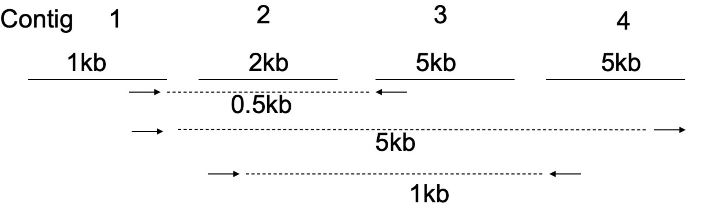

[](https://classroom.github.com/a/HxTURW4P)
<sub>Prof. K. Nieselt and Prof. S. Nahnsen - Institute for Bioinformatics and Medical Informatics - University of Tübingen - SoSe 2024</sub>

# Grundlagen der Bioinformatik - Assignment 08

**Hand out:** Thursday, June, 20, 6 pm

**Hand in:** Thursday, June, 27, 6 pm

> 💡Please read the task descriptions carefully. If there are any questions, you may ask them during the tutorial session or in the forum of ILIAS. You will usually get an answer in time, but late e-mails (e.g. the evening of the hand-in) might not be answered in time. You can push local changes to your fork as often as necessary, but make sure your final solution is pushed before the deadline!

> On this Assignment you can decide if you want to work on either task 2. Scaffolding or task 3. DNA mutation rates. If you decide to work on both tasks, we will give the additional points as a bonus.

## Theoretical Assignments

> 💡Please provide your answer in this document. If you want to include pictures, please include only good quality pictures or scans. Make your life easier by using a markdown preview tool such as https://dillinger.io/ for editing. Please double check correct formatting on your GitHub fork before you hand in.

### 1. Assembly with OLC (5P)

In this task we ask you to perform the layout part of the OLC - (overlap, layout, consensus) - approach for the given set of reads by hand.

Given reads ${\cal F}=\{f_1,f_2,\dots,f_6\}$, each of length 500, that overlap as follows:

$o(5'f_3-3'f_2)=230$ \
$o(3'f_1-3'f_2)=150$\
$o(5'f_5-3'f_4)=125$\
$o(3'f_1-3'f_4)=100$\
$o(5'f_4-5'f_6)=400$\
$o(3'f_1-3'f_3)=375$\
$o(3'f_4-3'f_2)=80$\
$o(3'f_4-3'f_5)=275$\
$o(3'f_4-5'f_1)=425$\
$o(3'f_1-3'f_5)=325$\
$o(5'f_5-5'f_6)=50$\
$o(3'f_6-5'f_1)=220$\
$o(3'f_6-3'f_3)=100$


Remember e.g. $o(5'f_3-3'f_2)=230$ means that the $5'$-end of $f_3$ overlaps the $3'$-end of $f_2$ by 230 bases and $o(3'f_6-3'f_2)=150$ means that the $3'$-ends of $f_6$ and $f_2$ overlap by 150 bases (see also lecture notes for the visual depiction).

(a)**The overlap graph**: Draw the overlap graph $OG$, labeling all edges as discussed in the lecture.

(b)**A minimal spanning tree**: Compute a spanning tree, containing all $read$ edges (it would be great if you used Prim's algorithm). In the $OG$ indicate visually your computed spanning tree.

(c)**The layout**: Draw the layout of the reads as given by the (minimal) spanning tree, indicating the precise coordinates of the start and end of each read. What is the length of the final assembly?

(d)**Consistent overlaps**: Are all overlaps in $OG$ consistent with the computed layout? If not, which overlaps are not consistent with the layout, and why?

> Hand in the overlap graph, the spanning tree and the resulting layout, you can hand in a handwritten and scanned solution. Note: If you choose to hand in a handwritten solution please provide clear and legible solutions. If you do not have the possibility of scanning, you can use mobile apps that return good quality scans, instead of only including a picture of your notes.

### Answer


### 2. Scaffolding (2P)
> Please choose either task 2. Scaffolding or task 3. DNA mutation rates or both for bonus points. 

The following figure illustrates the outcome of an assembly. It resulted in 4 contigs.

<p align= "center">
    
</p>


In the next step scaffolding shall be conducted. For this the information of paired-end sequencing has been used, and reads have been aligned to the contig consensus sequences. Most paired-end reads are mapped together, so both reads align within a respective contig, which does not help for the scaffolding step. However, some paired-end reads were mapped to two different contigs, which helps with scaffolding. This is also depicted in the figure. Arrows connected by a dashed line indicate mate pairs (recall that facing arrows represent the same strand, while non-facing indicate opposite strands). The number above the contigs refers to the contig length, the numbers below the dashed line to the insert size of the respective clone.

(a) Order the contigs 1-4 and give them their correct orientation (direction). This problem has more than one correct answer. Please report two different solutions.

(b)From your scaffolding, how long is the predicted length of the assembled (genome)?


### Answer

`<Provide answer here>`


### 3. DNA mutation rates (2P)
> Please choose either task 2. Scaffolding or task 3. DNA mutation rates or both for bonus points.

In this task, we will model the mutation rates between DNA nucleotides (A, C, G, T) using a Markov model. The transition matrix representing the mutation rates is given below:

$$
P = [P_{ij}]=\begin{array}{c|cccc|}
& A & C & G & T \\
\hline
A & 0.85 & 0.05 & 0.05 & 0.05 \\
C & 0.10 & 0.80 & 0.05 & 0.05 \\
G & 0.10 & 0.10 & 0.75 & 0.05 \\
T & 0.10 & 0.10 & 0.10 & 0.70 \\
\end{array}$$

1. Assume the base in the sequence is C, what is the probability that it will mutate to G in two steps?

2. Generalize this to an equation computing the probability that any Markov chain with $k$ states, starting in state $s_i$, will be in state $s_j$ after $n$ steps.


## Practical Assignments

> 💡For the practical assignments you should keep a good structure in your code, e.g. implement separate functions to solve the sub-tasks presented. All code must be well documented. Points will be deducted for insufficient comments. If we can’t run your program, it will not be graded. _All code and reference files are found within the repository, please implement your solution and push. Ensure that your final solution is merged into the main branch of your repository._


### 4. Markov Chains (8P)

Assume the following biological scenario on planet Vogsphere. Here, the genome sequences only consist of two nucleotides, R and Y, and can be divided in **genic** and **non-genic** regions. It is known that the transition probabilities of the nucleotides differ between **genic** and **non-genic** regions. 

For the given nucleotide sequence $x$ (`data/test.fasta`) you wonder whether it comes from a **genic** or **non-genic** region. Luckily, you have a training set (`data/train_genic.fasta`, `data/train_non_genic.fasta`) available in order to empirically compute the transition matrices $P^{genic}$ and $P^{non-genic}$ and determine if the given sequence $x$ comes from a **genic** or **non-genic** region.

>💡 For this task we provide you with a code template `src/TransitionMatrixCalculator.java`. Please implement all the functions in this template. 

(a) Implement a program that computes the transition matrices $P^{genic}$ and $P^{non-genic}$ from the provided respective training fasta files. Print the matrices to the console. 

(b) With your computed transition matrices, calculate the probability of the sequence $x$ in `test.fasta` under each of the two models **genic** and **non-genic**. 

(c) Next, calculate the log-odds ratio of the probabilities for the sequence $x$ under the two models.

(d) What do you conclude from your findings? Does the sequence $x$ originate from a **genic** or a **non-genic** region? Please explain your decision.    

### Answer

The sequence is more likely to originate from a non-genic region. 

The log-odds ratio of -29.844742619396353 indicates that the probability of the sequence fitting the non-genic model is much higher than fitting the genic model.

Explanation:


- The genic transition matrix shows a strong tendency for nucleotides to remain the same (high probabilities for R to R and Y to Y transitions).
- The non-genic transition matrix has more balanced probabilities between staying the same and switching nucleotides.
- The test sequence's transitions fit the balanced nature of the non-genic matrix better than the strong self-transition nature of the genic matrix.
- this means: the sequence is statistically more likely to be non-genic (as shown by the negative log-odds ratio).

--- 
### From Assignment 7 
### 4. Sequencing Read Quality Control (5P)

In this exercise we will continue the task of simulating 3 sets of reads with different read qualities from last week. This week we ask you to use the simulated data and perform a quality control on the reads using fastQC, and compare the results of the different simulations using MultiQC as well as briefly discuss your results. For each of the sub-tasks include the command you used to solve the task.


(c) Investigate the quality of your reads from last week using [FastQC](https://www.bioinformatics.babraham.ac.uk/projects/fastqc/) on each file.


### Answer (also see assignment 7)

As you can see Run 1 has a poor quality (with the first one of the 30X beeing slightly better then the second). All the other runs show a good/ useable quality.


(d) Summarize all FastQC results into one common HTML report using [MultiQC](https://multiqc.info/). Hand in the created HTML report as an additional file.

### Answer

html file in folder dataReport

command used:

````
multiqc D:/BioInformatikTools/GenomeSeqTools/art_bin_MountRainier/Runs/FastaQCReports
````


(e) Discuss the quality of the three different paired-end sequencing experiments. What is the impact of the quality scores of each run? Include meaningful figures from the MultiQC report in your discussion. In your text, make sure that you correctly refer to the included figures. How certain would be the results of an assembly for each of the different sequencing runs?

Write about maximally 300 words.

### Answer

```
As general Assumptions we can say:

Run 1: Low certainty due to high error rates, despite high coverage.
Run 2: Moderate to high certainty, with balanced coverage and improved read quality.
Run 3: Low certainty due to insufficient coverage, despite improved read quality.

(From Figure FastQC: Mean Quality Scores)
Run 2 seems to result into the best quality scores, while run 3 is slightly worse but still in the green area of good quality.
Run 1 is the worst of all, with both sub runs being in the red area corresponding to a very bad quality score.

(From Figure FastQC: General Statistics table %Dups)
Run 1:
Low Duplication: Since Run 1 has very few duplicated sequences, it suggests a more diverse set of reads covering different regions of the genome.
Impact: This diversity can potentially lead to a more complete assembly, as different regions of the genome are covered with unique reads, reducing bias in coverage and improving the accuracy of repetitive regions.

Run 2:
High Duplication: Higher duplication rates indicate that certain regions of the genome are overly represented in the dataset.
Impact: This can lead to bias in coverage and potentially cause assembly issues in repetitive regions.
(Assembly software might struggle to correctly resolve repeats or may collapse duplicated regions into fewer copies, leading to a fragmented assembly.)

Run 3:
Moderate Duplication: Similar to Run 2, moderate duplication rates indicate some bias in coverage but to a lesser extent.
Impact: While not as severe as in Run 2, moderate duplication can still affect assembly quality, especially in complex genomic regions. The assembly may have more gaps or misassemblies compared to Run 1`
````

> 💡Hint: To install FastQC and MultiQC you can use the package manager [mamba](https://mamba.readthedocs.io/en/latest/installation/mamba-installation.html). The link guides you to the installation documentation. To install the software with mamba see [FastQC](https://bioconda.github.io/recipes/fastqc/README.html) and [MultiQC](https://bioconda.github.io/recipes/multiqc/README.html). However it is not required to use mamba for installation.


